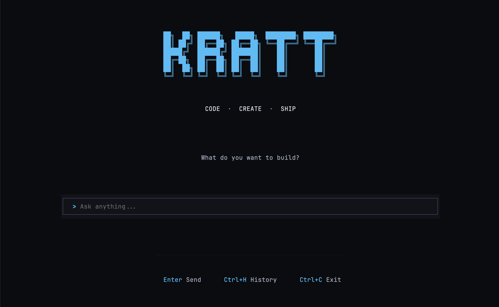
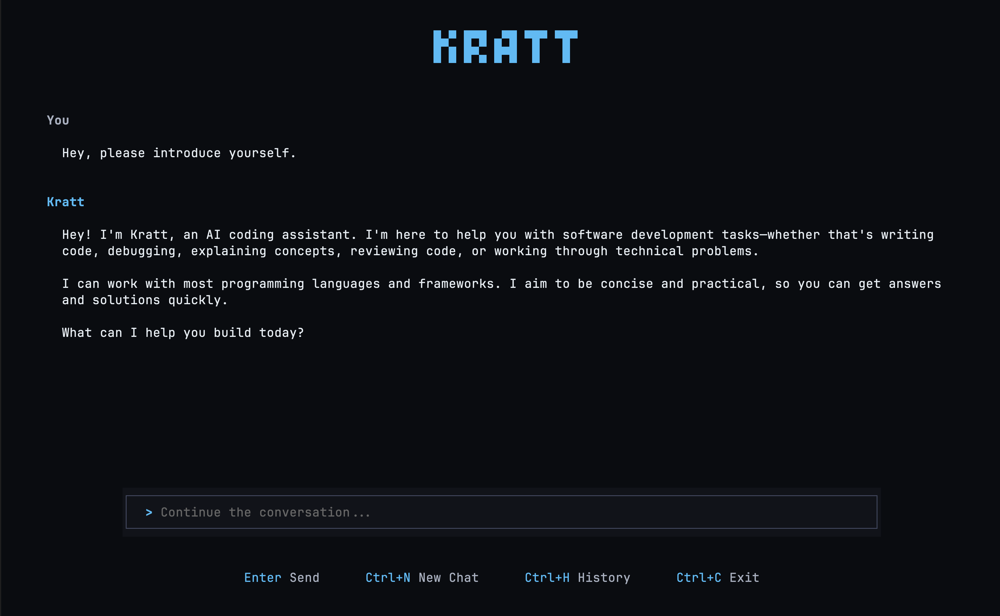
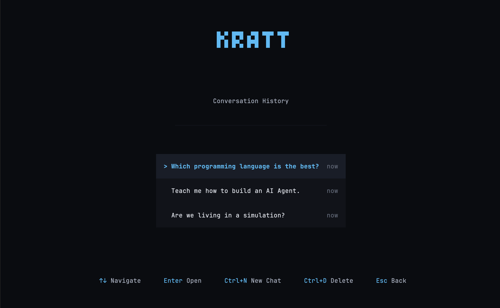

<div align="center">

# KRATT

### Code · Create · Ship

A terminal-based AI coding agent powered by Claude

[](#tech-stack)
[](#tech-stack)
[](#tech-stack)
[](#tech-stack)
[](https://opensource.org/licenses/MIT)

</div>

---

## Overview

Kratt is an AI coding agent that runs directly in your terminal. It helps you with software development tasks like writing code, debugging, explaining concepts, architecture discussions, and more. It is a more minimal version of the more popular AI Agents like Claude Code and Open Code.

<div align="center">
  
  <p><em>Home screen with the familiar terminal interface</em></p>
</div>

<div align="center">
  
  <p><em>Interactive chat with the AI assistant</em></p>
</div>

<div align="center">
  
  <p><em>Browse and resume previous conversations</em></p>
</div>

---

## Prerequisites

Kratt requires [Bun](https://bun.sh) to be installed on your system.

**macOS / Linux:**

```bash
curl -fsSL https://bun.sh/install | bash
```

**Windows:**

```powershell
powershell -c "irm bun.sh/install.ps1 | iex"
```

You will also need an [Anthropic API key](https://console.anthropic.com/) to use Kratt.

---

## Getting Started

**1. Clone the repository**

```bash
git clone https://github.com/margusliinev/kratt.git
cd kratt
```

**2. Set up environment variables**

```bash
cp .env.example .env
```

**3. Add your API key**

Open `.env` and replace `your_anthropic_api_key_here` with your actual Anthropic API key.

**4. Install dependencies**

```bash
bun install
```

**5. Build the project**

```bash
bun run build
```

**6. Start Kratt**

```bash
bun run start
```

---

## Keyboard Shortcuts

| Key      | Action              |
| -------- | ------------------- |
| `Enter`  | Send message        |
| `Ctrl+N` | New chat            |
| `Ctrl+H` | View history        |
| `Ctrl+D` | Delete conversation |
| `Ctrl+C` | Exit                |

---

## Project Structure

```
kratt/
├── src/
│   ├── config/          # Environment configuration
│   │   └── env.ts
│   ├── core/            # Business logic
│   │   ├── repositories/    # Data access layer
│   │   ├── services/        # AI and conversation services
│   │   ├── db.ts            # Database setup
│   │   ├── types.ts         # Type definitions
│   │   └── index.ts
│   ├── ui/              # Terminal UI
│   │   ├── components/      # Reusable UI components
│   │   ├── hooks/           # React hooks
│   │   ├── layouts/         # Layout components
│   │   ├── theme/           # Styling and colors
│   │   └── terminal.tsx     # Main terminal component
│   └── index.tsx        # Application entry point
├── docs/
│   └── assets/          # Screenshots and images
├── build.ts             # Build script
└── package.json
```

---

## Tech Stack

| Technology                                                              | Purpose                        |
| ----------------------------------------------------------------------- | ------------------------------ |
| [Bun](https://bun.com)                                                  | JavaScript runtime and bundler |
| [TypeScript](https://www.typescriptlang.org)                            | Type-safe development          |
| [React](https://react.dev)                                              | UI component framework         |
| [OpenTUI](https://github.com/opentui/opentui)                           | Terminal UI rendering          |
| [Anthropic SDK](https://github.com/anthropics/anthropic-sdk-typescript) | Claude AI integration          |
| [Zod](https://zod.dev)                                                  | Runtime type validation        |

---

## License

This project is licensed under the MIT License - see the [LICENSE](LICENSE) file for details.
